<p align="center">
  
</p>

<h1 align="center">Thegreatprabh</h1>

<p align="center">
  <b>Builder of clean tools, smart automations, sharp dashboards, and useful digital products.</b>
</p>

<p align="center">
  <a href="https://github.com/Thegreatprabh?tab=followers">
    
  </a>
  
  
</p>

---

### System Status

```txt
USER        Thegreatprabh
MODE        learning fast, building sharper, shipping better
STACK       Python | JavaScript | React | Node | APIs | automation
MISSION     turn raw ideas into clean products people can actually use
SIGNAL      discipline > noise
```

### About Me

I like building things that feel simple on the outside and powerful under the hood. My work sits around coding, automation, dashboards, AI-assisted workflows, and practical tools that save time or make an idea easier to use.

Right now, I am focused on becoming the kind of developer who can take a rough thought, break it down, build the system, polish the interface, and ship something that feels real.

### Current Loadout

<p>
  
</p>

### Battle-Tested Tools

| Tool | What it does |
| --- | --- |
| **Automation systems** | Turns repeated work into scripts, workflows, and connected tools. |
| **Dashboard builds** | Creates clean interfaces for tracking data, progress, and decisions. |
| **Full-stack experiments** | Builds practical web apps with useful flows, APIs, and real structure. |
| **Problem-solving mode** | Reads messy requirements, breaks them down, and ships a working version. |
| **Launch polish** | Writes READMEs, setup flows, docs, and product pages that look serious. |

### GitHub Radar

<p align="center">
  
  
</p>

<p align="center">
  
</p>

<p align="center">
  
</p>

### Operating Principles

- Build tools that save time every single day.
- Keep interfaces clean, fast, and practical.
- Automate the boring parts, understand the important parts.
- Ship first version quickly, then sharpen it with real feedback.

### Featured Arsenal

<!-- Replace these with your best repositories when ready. -->

<p align="center">
  <a href="https://github.com/Thegreatprabh?tab=repositories">
    
  </a>
</p>

### Contribution Snake

<p align="center">
  <picture>
    <source media="(prefers-color-scheme: dark)" srcset="https://raw.githubusercontent.com/Thegreatprabh/Thegreatprabh/output/github-snake-dark.svg" />
    <source media="(prefers-color-scheme: light)" srcset="https://raw.githubusercontent.com/Thegreatprabh/Thegreatprabh/output/github-snake.svg" />
    
  </picture>
</p>

### Connect

<p align="center">
  <a href="https://github.com/Thegreatprabh">
    
  </a>
  <a href="https://instagram.com/thegreatprabh">
    
  </a>
  <a href="mailto:thegreatprabh@gmail.com">
    
  </a>
</p>

<p align="center">
  <sub>Profile engineered for impact. Keep building.</sub>
</p>
